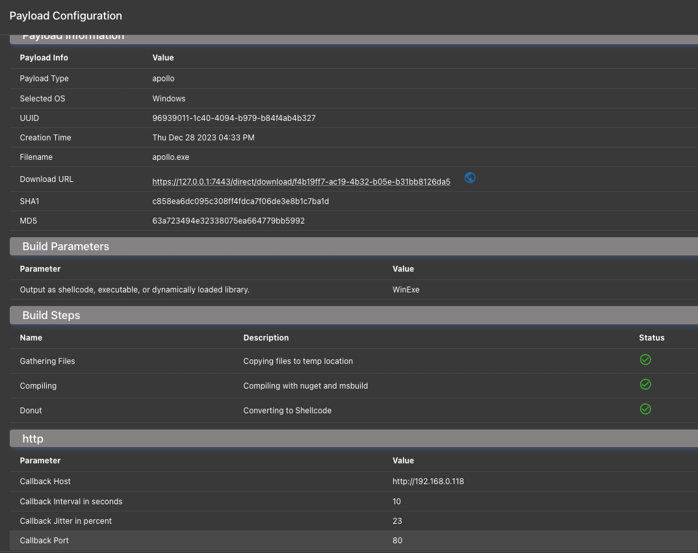

# 6. File Hosting

## What is it?

There are times you want to host a file or payload through your C2 channel at a custom endpoint. However, every C2 profile works a bit differently; so, there needs to be a way to universally tell the C2 profile to host a file in its own way at a certain endpoint.

## What does it look like?

Below is the function definition to include with your C2 profile to host a custom file.&#x20;



```python
async def host_file(self, inputMsg: C2HostFileMessage) -> C2HostFileMessageResponse:
    """Host a file through a c2 channel

    :param inputMsg: The file UUID to host and which URL to host it at
    :return: C2HostFileMessageResponse detailing success or failure to host the file
    """
    response = C2HostFileMessageResponse(Success=True)
    response.Message = "Not Implemented"
    response.Message += f"\nInput: {json.dumps(inputMsg.to_json(), indent=4)}"
    return response
```





```go
HostFileFunction           func(message C2HostFileMessage) C2HostFileMessageResponse
```

```go
package c2structs

type C2_HOST_FILE_STATUS = string

type C2HostFileMessage struct {
   Name     string `json:"c2_profile_name"`
   FileUUID string `json:"file_uuid"`
   HostURL  string `json:"host_url"`
}

type C2HostFileMessageResponse struct {
   Success bool   `json:"success"`
   Error   string `json:"error"`
}
```



## Where is it?

In the Mythic UI, you'll see blue globe icons that open prompts to host those files via any C2. For example, looking at the Payload's table and clicking the information icon you'll see something like the following:

<figure><figcaption></figcaption></figure>

Here you can see the blue globe icon. Click that and supply the endpoint you want to use, let's say `/bob` along with the c2 profile you want to use. For our example, let's say `http`, but it could be any egress profile that has this method implemented. The C2 profile should automatically stop and start to ingest the change, but if it doesn't, you might need to toggle the c2 profile off and on again from the payload types and c2 profiles page to make sure the change is picked up by the internal server. From there, you can hit the `/bob` endpoint at that C2 profile to fetch the file.
