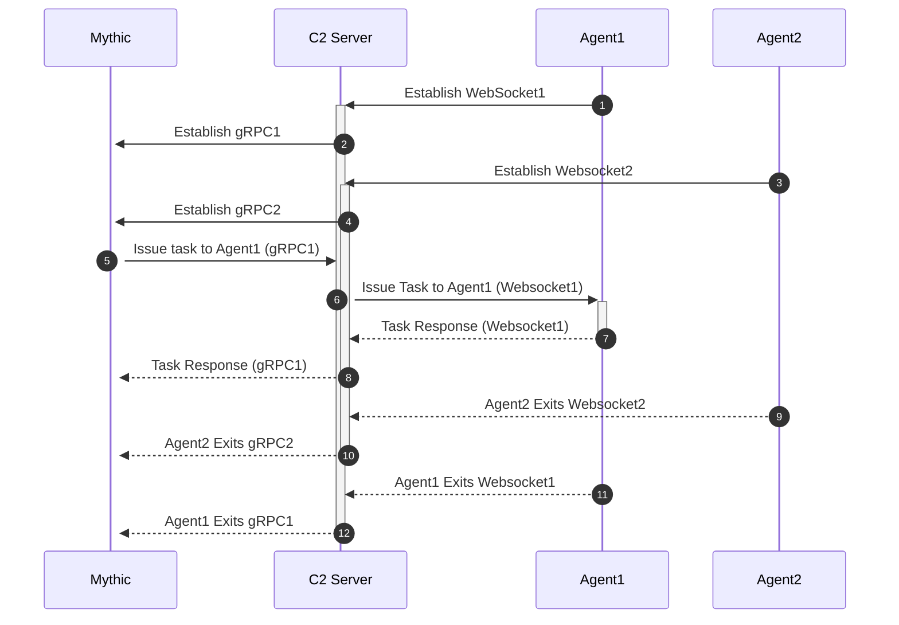
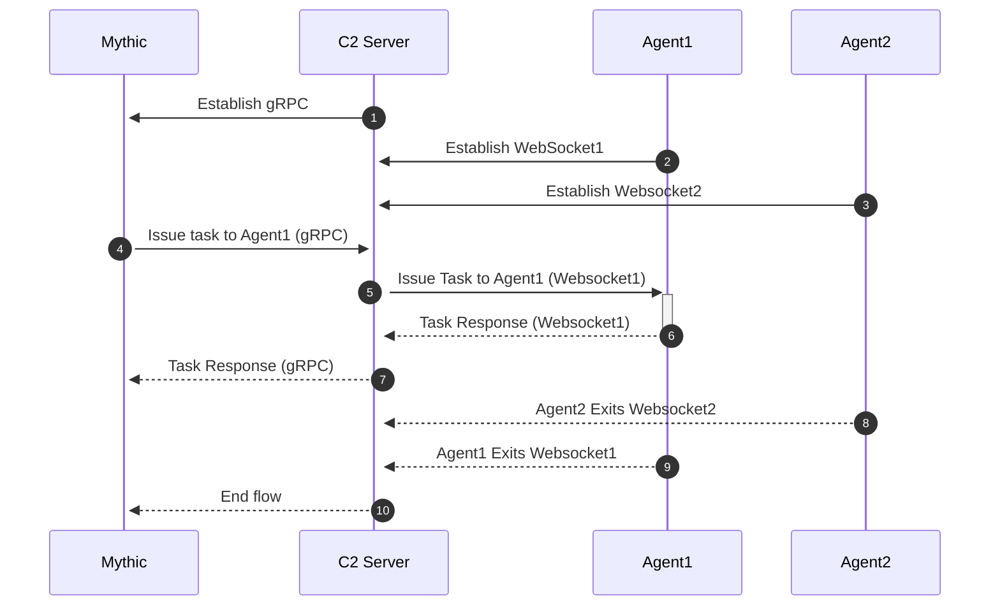

# 9. Push C2

## What is it?

Push C2 is a way to do egress C2 channels without requiring the agent to beacon periodically for tasking. Instead, a connection is held open and Mythic "Pushes" tasks and data down to the agent. This is very similar to how many Peer-to-peer (P2P) agents handle connections, just extended to the egress side of things.&#x20;

## How does it work?

For this to work, there needs to be a held open connection between the C2 Profile docker container and the Mythic server itself. This is done via gRPC. As part of this held open connection, the C2 profile identifies itself and forwards along messages.&#x20;

## What does it look like?

In the mythic UI, the last checkin time will change to 1970-01-01 and appear as `Streaming Now`. The moment the held open gRPC connection disconnects, that time will update to the current UTC time. This makes it very easy to know that a connection is currently held open even if no traffic is going through it.

Below are some simplified examples of working with this gRPC. An example of this Push style C2 as part of websockets is available with the `websocket` C2 profile.



<pre class="language-python" data-line-numbers><code class="lang-python">from mythic_container.grpc.pushC2GRPC_pb2_grpc import PushC2Stub
from mythic_container.grpc import pushC2GRPC_pb2 as grpcFuncs
import grpc.aio


<strong>async def handleStreamConnection(client):
</strong>    global UUIDToWebsocketConn
    global grpcStream
    try:
        while True:
            grpcStream = client.StartPushC2Streaming()
            # first send a connect message telling Mythic who this is

            logger.info(f"Connected to gRPC for pushC2 Streaming")
            async for request in grpcStream:
                # this is streaming responses from Mythic to go to agents
                try:
                    # do something with request
                except Exception as d:
                    logger.exception(f"Failed to process handleStreamConnection message:\n{d}")

            logger.error(f"disconnected from gRPC for handleStreamConnection")
    except Exception as e:
        logger.exception(f"[-] exception in handleStreamConnection: {e}")


async def handleGrpcStreamingServices():
    maxInt = 2 ** 31 - 1
    while True:
        try:
            logger.info(f"Attempting connection to gRPC for pushC2...")
            channel = grpc.aio.insecure_channel(
                f'127.0.0.1:17444',
                options=[
                    ('grpc.max_send_message_length', maxInt),
                    ('grpc.max_receive_message_length', maxInt),
                ])
            await channel.channel_ready()
            client = PushC2Stub(channel=channel)
            streamConnections = handleStreamConnection(client)
            logger.info(f"[+] Successfully connected to gRPC for pushC2")
            await asyncio.gather(streamConnections)
        except Exception as e:
            logger.exception(f"Translation gRPC services closed for pushC2: {e}")
            
asyncio.run(handleGrpcStreamingServices())
</code></pre>






```go
PushConn := mythicGRPC.GetNewPushC2ClientConnection()
grpcClient := services.NewPushC2Client(PushConn)
streamContext, cancel := context.WithCancel(context.Background())
defer func() {
    cancel()
}()
grpcStream, err := grpcClient.StartPushC2Streaming(streamContext)
if err != nil {
	log.Printf("Failed to get new client: %v\n", err)
	return
} else {
	log.Printf("Got new push client")
}
// sending a message from an agent to Mythic
readErr = grpcStream.Send(&services.PushC2MessageFromAgent{
	C2ProfileName: "websocket",
	RemoteIP:      websocketClient.RemoteAddr().String(),
	TaskingSize:   0,
	Message:       nil,
	Base64Message: []byte(fromAgent.Data),
})
if readErr != nil {
	log.Printf("failed to send message to grpc stream: %v\n", readErr)
	grpcStream.CloseSend()
	return
}
// getting a message from Mythic
fromMythic, readErr := grpcStream.Recv()
if readErr != nil {
	log.Printf("Failed to read from grpc stream, closing connections: %v\n", readErr)
	grpcStream.CloseSend()
	return
}
dataContent := fromMythic.GetMessage(
```




### Agent Expectations

How is an agent supposed to work with a Push-style C2 profile? It's the same as working with a Peer-to-peer (P2P) profile:

* If a payload is executed (it's not a callback yet), then reach out to the C2 profile to make a connection. Once a connection is established, start your normal encrypted key exchange or checkin process
* If an existing callback loses connection for some reason, then reach out to the C2 profile to make a connection. Once a connection is established, send your checkin message again to inform Mythic of your existence
* At this point, just wait for messages to come to you (no need to do a get\_tasking poll) and as you get any data (socks, edges, alerts, responses, etc) just send them out through your c2 connection.

## Types of Push C2

There are two types of Push C2. They both function largely the same, but within the C2 server they function differently.&#x20;

### One-to-One

The first one is probably the most common, one-to-one. This means that for every agent that connects to the C2 server (typically with a held-open connection like a WebSocket), the C2 server also opens one gRPC connection to Mythic. The following is a diagram what this means:



In this case, the C2 server connects via:

```go
grpcClient.StartPushC2Streaming(streamContext)
```

The first C2 server is just acting like a proxy in this case and forwards the agent's messages along.&#x20;

```go
grpcStream.Send(&services.PushC2MessageFromAgent{
    C2ProfileName: "websocket",
    RemoteIP:      websocketClient.RemoteAddr().String(),
    Message:       nil,
    Base64Message: []byte(fromAgent.Data),
})
```

The above snippet shows an example of sending a message from an agent - we specify the c2 profile name, the remote IP, and in this case, we're passing along the direct base64 blob from the agent. If you wanted to, depending on how your C2 functions, you could pass along a base64 decoded version in the `Message` field instead.

Once Mythic is done processing a message, we can send the response back to the agent:

```go
fromMythic, readErr := grpcStream.Recv()
if readErr != nil {
    log.Printf("Failed to read from grpc stream, closing connections: %v\n", readErr)
    return
}
fromMythic.GetMessage() // do something with the message from Mythic
```

### One-to-Many

The other type of Push C2 is one-to-many. This functions largely the same as one-to-one, except that the C2 server only ever opens up one gRPC connection to Mythic with many agents that go through it. Below is a diagram showing this flow:



&#x20;Because of this, we need to make sure that the user understands that all agents using this C2 profile are sharing a connection with Mythic. We start this connection by telling Mythic that our C2 profile wants to open a oneToMany stream:

```python
grpcStream = client.StartPushC2StreamingOneToMany()
await grpcStream.write(grpcFuncs.PushC2MessageFromAgent(
    C2ProfileName="websocket"
))
```

Notice how the function call is `StartPushC2StreamingOneToMany()` and not `StartPushC2Streaming` like in the one-to-one example. Before we even get any agent connections, we send a message to the gRPC stream with just the c2 profile name. This let's Mythic know that we have a new one-to-many c2 profile running and the name of that connection.

At this point, everything works the same as before with the one-to-one profile. As agents send the profile messages, the c2 profile should forward them off to Mythic via the stream and read from the stream to send messages back. You're probably wondering though - how is the multiplexing happening between the one connection to Mythic and the many agents on the other side?&#x20;

This stream utilizes a `TrackingID` that's supplied by the C2 profile to track these individual streams:

```python
await grpcStream.write(grpcFuncs.PushC2MessageFromAgent(
    C2ProfileName="websocket",
    RemoteIP=str(websocketConn.remote_address),
    Base64Message=jsonMsg["data"].encode("utf-8"),
    TrackingID=connUUID
))
```

This `TrackingID` is something generated by the C2 profile when sending messages and is echoed back as part of the responses that Mythic sends. This allows a C2 Profile to do the proper correlation with messages it gets back and which agent to send it to. This data is saved and tracked by Mythic so that it can be used even when Mythic is the one sending the initial piece of data (like a new task). Let's look at a slightly more complete example to see how that works:


```python
import asyncio
import uuid

import websockets
from websockets.server import serve
from mythic_container.logging import logger
from mythic_container.grpc.pushC2GRPC_pb2_grpc import PushC2Stub
from mythic_container.grpc import pushC2GRPC_pb2 as grpcFuncs
import grpc.aio
import json

UUIDToWebsocketConn = {}
grpcStream = None


async def handleStreamConnection(client):
    global UUIDToWebsocketConn
    global grpcStream
    try:
        while True:
            grpcStream = client.StartPushC2StreamingOneToMany()
            await grpcStream.write(grpcFuncs.PushC2MessageFromAgent(
                C2ProfileName="websocket"
            ))
            logger.info(f"Connected to gRPC for pushC2 StreamingOneToMany")
            async for request in grpcStream:
                # this is streaming responses from Mythic to go to agents
                try:
                    if request.TrackingID in UUIDToWebsocketConn:
                        logger.info(f"sending message back to websocket for id: {request.TrackingID}")
                        await UUIDToWebsocketConn[request.TrackingID].send(json.dumps({"data": request.Message.decode()}))
                    else:
                        logger.error(f"tracking ID not tracked: {request.TrackingID} ")
                except Exception as d:
                    logger.exception(f"Failed to process handleStreamConnection message:\n{d}")

            logger.error(f"disconnected from gRPC for handleStreamConnection")
    except Exception as e:
        logger.exception(f"[-] exception in handleStreamConnection: {e}")


async def handleGrpcStreamingServices():
    maxInt = 2 ** 31 - 1
    while True:
        try:
            logger.info(f"Attempting connection to gRPC for pushC2OneToMany...")
            channel = grpc.aio.insecure_channel(
                f'127.0.0.1:17444',
                options=[
                    ('grpc.max_send_message_length', maxInt),
                    ('grpc.max_receive_message_length', maxInt),
                ])
            await channel.channel_ready()
            client = PushC2Stub(channel=channel)
            streamConnections = handleStreamConnection(client)
            logger.info(f"[+] Successfully connected to gRPC for pushC2OneToMany")
            await asyncio.gather(streamConnections)
        except Exception as e:
            logger.exception(f"Translation gRPC services closed for pushC2OneToMany: {e}")


async def handle_connection(websocketConn: websockets.WebSocketServerProtocol):
    global UUIDToWebsocketConn
    global grpcStream
    connUUID = str(uuid.uuid4())
    logger.info(f"New tracking ID created: {connUUID}")
    UUIDToWebsocketConn[connUUID] = websocketConn
    try:
        async for message in websocketConn:
            # get message from agent and send it to grpc stream
            logger.info(f"new websocket msg for id: {connUUID}")
            while True:
                if grpcStream is None:
                    await asyncio.sleep(1)
                    continue
                break
            try:
                jsonMsg = json.loads(message)
                await grpcStream.write(grpcFuncs.PushC2MessageFromAgent(
                    C2ProfileName="websocket",
                    RemoteIP=str(websocketConn.remote_address),
                    Base64Message=jsonMsg["data"].encode("utf-8"),
                    TrackingID=connUUID
                ))
            except Exception as e:
                logger.info(f"Hit exception trying to send websocket message to grpc: {e}")
                await asyncio.sleep(1)
    except Exception as c:
        if grpcStream is not None:
            logger.info(f"websocket connection dead, removing it: {connUUID}")
            try:
                del UUIDToWebsocketConn[connUUID]
                await grpcStream.write(grpcFuncs.PushC2MessageFromAgent(
                    C2ProfileName="websocket",
                    RemoteIP=str(websocketConn.remote_address),
                    TrackingID=connUUID,
                    AgentDisconnected=True
                ))
            except Exception as e:
                logger.error(f"Failed to send message to Mythic that connection dropped: {e}")


async def main():
    logger.info("starting grpc connection server")
    asyncio.create_task(handleGrpcStreamingServices())
    logger.info("starting websocket server")
    async with serve(handle_connection, "127.0.0.1", 8081):
        await asyncio.Future()


asyncio.run(main())
```


Here we have a version of the websocket profile - this version uses the one-to-many format. On initial WebSocket connection, we generate a UUID and save the UUID + connection information off into a global variable. We then send that data off into the gRPC stream.

When we get data back from the gRPC stream, we use the same `TrackingID` that's echoed back to look up the corresponding WebSocket stream and send data that way.&#x20;

There's one additional piece here that hasn't been covered yet though - `AgentDisconnected`. Since all agents on the other side of this gRPC connection are sharing the one connection to Mythic, if that gRPC connection exits, then Mythic detects that and marks **ALL** agents that use that C2 profile has having lost that connection. However, what if just _one_ agent on the other end disconnects? The main gRPC connection is still there, so we need a way to inform Mythic that one remote connection is gone. This is where the `AgentDisconnected` piece comes into play:

```python
await grpcStream.write(grpcFuncs.PushC2MessageFromAgent(
                    C2ProfileName="websocket",
                    RemoteIP=str(websocketConn.remote_address),
                    TrackingID=connUUID,
                    AgentDisconnected=True
                ))
```

By sending this message with the same TrackingID that the agent was using, Mythic can look up the corresponding Callback and mark it as no longer "Now Streaming...". If at any point the agent re-connects, then you can use a new TrackingID or even the same TrackingID and everything will connect right back up (assuming the agent sends a message like the checkin message) and the callback's last checkin will update back to "Now Streaming...".

Detecting an agent as gone is easy when we have a held open connection like a WebSocket. Sometimes though, it's not nearly as easy. This is up to you, the C2 developer. You could always leave the agents as "Now Streaming...", but that might be a little confusing for operators. Instead, you could have a timeout where if you haven't heard from a particular agent in a certain amount of time, mark them as gone. If they send a message again later, great, if not though, then at least the user has an idea that the agent might not be there anymore.
