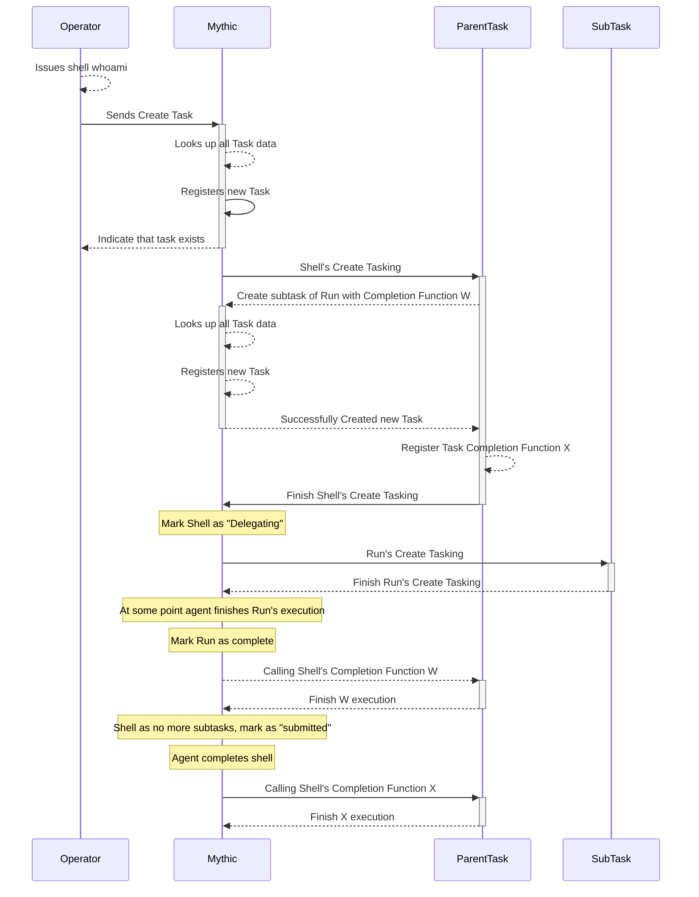

# 8. Sub-tasking / Task Callbacks

## What is sub-tasking?

Sub-tasking is the ability for a task to spin off sub-tasks and wait for them to finish before potentially entering a "submitted" state themselves for an agent to pick them up. When creating subtasks, your `create_go_tasking` function will finish completing like normal (it doesn't wait for subtasks to finish).

When a task has outstanding subtasks, its status will change to "delegating" while it waits for them all to finish.

<figure><figcaption></figcaption></figure>

### Why do subtasks?

Subtasking provides a way to separate out complex logic into multiple discrete steps. For example, if a specific task you're trying to do ends up with a complex series of steps, then it might be more beneficial for the agent developer and operator to see them broken out. For example, a `psexec` command actually involves a lot of moving pieces from making sure that you:

* have a service executable (or some sort-lived task that is ok to get killed by the service control manager)
* can access the remote file system
* can write to the remote file system in some way (typically smb)
* can create a scheduled task
* can delete the scheduled task
* can remove the remote file

That's a lot of steps and conditionals to report back. If any step fails, are you able to track down _where_ it failed and the status of any of the cleanup steps (if any performed at all)? That starts to become a massive task, especially when other parts of the task might already be separate tasks within the agent. Creating/manipulating scheduled tasks could be its own command, same with copying files to a remote share. So, at that point you're either duplicating code, or you have some sort of shared dependency. It would be easier if you could just issue these all as subtasks and let each one handle its job as needed in smaller, isolated chunks.

### How to create subtasks?

Creating subtasks are pretty easy:



```python
async def create_go_tasking(self, taskData: PTTaskMessageAllData) -> PTTaskCreateTaskingMessageResponse:
        response = PTTaskCreateTaskingMessageResponse(
            TaskID=taskData.Task.ID,
            Success=True,
        )
        await SendMythicRPCTaskCreateSubtask(MythicRPCTaskCreateSubtaskMessage(
            TaskID=taskData.Task.ID,
            CommandName="run",
            Params="cmd.exe /S /c {}".format(taskData.args.command_line)
        ))
        return response
```







This function called be called from within your `create_go_tasking` or even task callbacks (in the next section). We're specifying the name of the command to run along with the parameters to issue (as a string). We can even specify a `SubtaskCallbackFunction` to get called within our current task when the subtask finishes. It's a way for the parent task to say "when this subtask is done, call this function so I can make more decisions based on what happened".  These callback functions look like this:





```python
async def downloads_complete(completionMsg: PTTaskCompletionFunctionMessage) -> PTTaskCompletionFunctionMessageResponse:
    response = PTTaskCompletionFunctionMessageResponse(Success=True)
    ...
    response.Success = False
    response.TaskStatus = "error: Failed to search for files"
    await SendMythicRPCResponseCreate(MythicRPCResponseCreateMessage(
        TaskID=completionMsg.TaskData.Task.ID,
        Response=f"error: Failed to search for files: {files.Error}".encode()
    ))
    return response
    
```


Notice how this function's parameters don't start with `self`. This isn't a function in your command class, but rather a function _outside_ of it. With the data passed in via the `PTTaskCompletionFunctionMessage` you should still have all you need to do MythicRPC\* calls though.


This `PTTaskCompletionFunctionMessage` has all the normal information you'd expect for the parent task (just like you'd see in your `create_go_tasking` function) as well as all the same information for your `subtask`. This makes it easy to manipulate both tasks from this context.


Note: If you want to modify the information about your current task, some fields can be updated via the `PTTaskCompletionFunctionMessageResponse`, but otherwise you'll need to use the `SendMythicRPCTaskUpdate` function call to update other attributes about your parent task (or anything about your subtask).








These callback functions are called in the _parent_ task that spawned the subtask in the first place.&#x20;


If you're creating subtasks and you want tokens associated with them (such as matching the token supplied for the parent task), then you **must** manually supply it as part of creating your subtask (ex: `Token=taskData.Task.TokenID`). Mythic doesn't assume subtasks also need the token applied.


### What does the flow look like?

Here we have the flow for a command, `shell`, that issues a subtask called `run` and registers two completion handlers - one for when `run` completes and another for when `shell` completes. Notice how execution of `shell`'s create tasking function continues even after it issues the subtask `run`. That's because this is all asynchronous - the result you get back from issuing a subtask is only an indicator of if Mythic successfully registered the task to not, not the final execution of the task.



## What are task callbacks?

Task callbacks are functions that get executed when a task enters a "completed=True" state (i.e. when it completes successfully or encounters an error). These can be registered on a task itself

```python
async def create_go_tasking(self, taskData: MythicCommandBase.PTTaskMessageAllData) -> MythicCommandBase.PTTaskCreateTaskingMessageResponse:
    response = MythicCommandBase.PTTaskCreateTaskingMessageResponse(
        TaskID=taskData.Task.ID,
        CompletionFunctionName="formulate_output",
        Success=True,
    )
    return response
```

or on a subtask:

```python
```

When Mythic calls these callbacks, it looks for the defined name in the command's `completed_functions` attribute like:

```
completion_functions = {"formulate_output": formulate_output}
```

Where the `key` is the same name of the function specified and the `value` is the actual reference to the function to call.

## Where are they?

Like everything else associated with a Command, all of this information is stored in your command's Python/GoLang file. Sub-tasks are created via RPC functions from within your command's `create_tasking` function (or any other function - i.e. you can issue more sub-tasks from within task callback functions). Let's look at what a callback function looks like:

```python
async def formulate_output( task: PTTaskCompletionFunctionMessage) -> PTTaskCompletionFunctionMessageResponse:
    # Check if the task is complete
    response = PTTaskCompletionFunctionMessageResponse(Success=True, TaskStatus="success")
    if task.TaskData.Task.Completed is True:
        # Check if the task was a success
        if not task.TaskData.Task.Status.includes("error"):
            # Get the interval and jitter from the task information
            interval = task.TaskData.args.get_arg("interval")
            jitter = task.TaskData.args.get_arg("interval")

            # Format the output message
            output = "Set sleep interval to {} seconds with a jitter of {}%.".format(
                interval / 1000, jitter
            )
        else:
            output = "Failed to execute sleep"

        # Send the output to Mythic
        resp = await SendMythicRPCResponseCreate(MythicRPCResponseCreateMessage(
                TaskID=taskData.Task.ID,
                Response=output.encode()
            ))

        if not resp.Success:
            raise Exception("Failed to execute MythicRPC function.")
    return response
```

## Task Callbacks

This is useful for when you want to do some post-task processing, actions, analysis, etc when a task completes or errors out. In the above example, the `formulate_output` function simply just displays a message to the user that the task is done. In more interesting examples though, you could use the `get_responses` RPC call like we saw above to get information about all of the output subtasks have sent to the user for follow-on processing.
