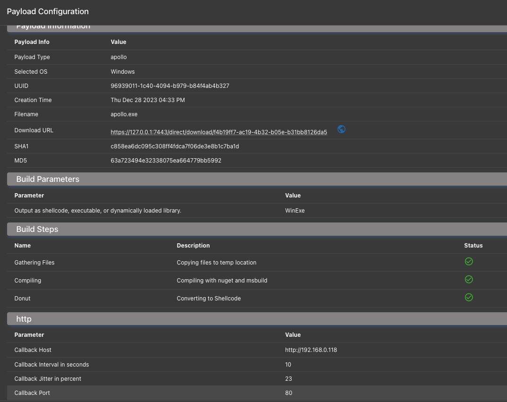

# Database Schema

## What is it?

The database schema describes the current state of Mythic within the `mythic_postgres` Docker container. Mythic tracks _everything_ in the Postgres database so that if an operator needs to close their browser or the server where Mythic runs reboots, nothing is lost. The benefit of having all data tracked within the database and simply streamed to the operator's interface means that all operators stay in sync about the state of the operation - each operator doesn't have to browse all of the file shares themselves to see what's going on and you don't have to grep through a plethora of log files to find that one task you ran that one time.

## Where is it?

The database lives in the `postgres-docker` folder and is mapped into the `mythic_postgres` container as a volume. This means that if you need to move Mythic to a new server, simply stop mythic with `./mythic-cli stop`, copy the `Mythic` folder to its new home, and start everything back up again with `./mythic-cli start`.&#x20;

On the first start of Mythic, the database schema is loaded from a schema file located in `mythic-docker`: [https://github.com/its-a-feature/Mythic/blob/master/mythic-docker/src/database/schema.go](https://github.com/its-a-feature/Mythic/blob/master/mythic-docker/src/database/schema.go).

## How is it used?

Since the database schema is the source of truth for all of Mythic, mythic scripting, and all of the operator's interfaces, it needs to be easily accessible in a wide range of cases.&#x20;

The `mythic_server` container connects directly to the `mythic_postgres` container to sync the containers and quickly react to agent messages. The `mythic_graphql` container (Hasura) also directly connects to the database and provides a GraphQL interface to the underlying data. This GraphQL interface is what both the React UI and mythic scripting use to provide a role-based access control (RBAC) layer on top of the database.

## How do I use it?

How do you, as an operator or developer, find out more about the database schema? The easiest way is to click the hamburger icon in the top left of Mythic, select "Services", and then select the "GraphQL Console". This drops you into the Hasura Login screen; the password for Hasura can be found randomly generated in your `Mythic/.env` file.

From here, the API tab, shown below, provides an easy way to dynamically explore the various queries, subscriptions, and modifications you can make to the database right here or via scripting.

<figure><figcaption>
Hasura Console
</figcaption></figure>

Since the Mythic Scripting simply uses this GraphQL interface as well, anything you put in that center body pane you can submit as a POST request to Mythic's grapqhl endpoint (shown above) to achieve the same result. The majority of the functions within Mythic Scripting are simply ease-of-use wrappers around these same queries.

If you want to have even more fun exploring how the GraphQL interface manipulates the database schema, you can check out the built-in Jupyter Notebook and test out your modifications there as well. As shown in the two screenshots below, you can create scripts to interact with the GraphQL endpoints to return only the data you want.

<figure><figcaption></figcaption></figure>

<figure><figcaption></figcaption></figure>

This scripting, combined with the Hasura GraphQL console allows operators to very easily get direct access and real-time updates to the database without having to know any specific SQL syntax or worry about accidentally making a schema change.
