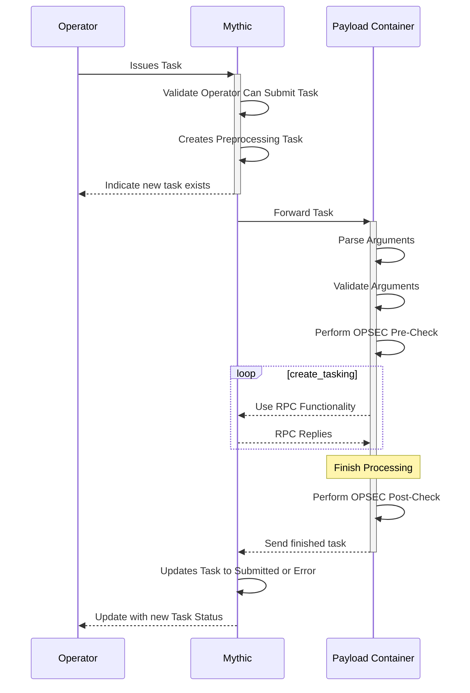

# Message Flow

## Operator Submits Tasking

There's a lot of moving pieces within Mythic and its agents, so it's helpful to take a step back and see how messages are flowing between the different components.



Here we can see an operator issue tasking to the Mythic server. The Mythic server registers the task as "preprocessing" and informs the operator that it got the task. Mythic then sends the task off to the corresponding Payload Type container for processing. The container looks up the corresponding command python file, parses the arguments, validates the arguments, and passes the resulting parameters to the create\_tasking function. This function can leverage a bunch of RPC functionality going back to Mythic to register files, send output, etc. When it's done, it sends the final parameters back to Mythic which updates the Task to either `Submitted` or `Error`. Now that the task is out of the `preprocessing` state, when an agent checks in, it can receive the task.

## Agent Sends Message


```

sequenceDiagram
    participant T as Translation Container
    participant M as Mythic
    participant C as C2 Profile Container
    participant A as Agent
    A ->>+ C: Agent Sends Message
    C ->>+ M: C2 Forwards to Mythic
    Note over M: Start Processing Message
    M ->> M: Base64 Decode and fetch UUID
    M ->>+ T: Send to Translator
    T ->> T: Decrypt Message
    T ->> T: Translate To Mythic JSON
    T -->>- M: Return JSON Message
    M ->> M: Process Message
    M ->> M: Process Delegates
    Note over M: Stop Processing Message
    M ->> M: Create Response
    M ->>+ T: Send to Translator
    T ->> T: Translate to Custom Format
    T ->> T: Encrypt Message
    T -->>- M: Return Final Blob
    M -->>- C: Return Final Blob
    C -->>- A: Return Final Message

```

Here we can see an agent sends a message to Mythic. The C2 Profile container is simply a fancy redirector that know show to pull the message off the wire, it doesn't do anything else than that. From there, Mythic starts processing the message. It pulls out the UUID so it can determine which agent/callback we're talking about. This is where a decision point happens:

* If the Payload Type associated with the payload/callback for the UUID of the message has a translation container associated with it, then Mythic will send the message there. It's here that the rest of the message is converted from the agent's special sauce C2 format into the standard JSON that Mythic expects. Additionally, if the Payload Type handles encryption for itself, then this is where that happens.
* If there is not translation container associated with the payload/callback for the UUID in the message, then Mythic moves on to the next step and starts processing the message.

Mythic then processes the message according to the "action" listed.

Mythic then potentially goes back to the translation container to convert the response message back to the agent's custom C2 spec before finally returning everything back through the C2 Profile docker container.

## What happens for building payloads?

What happens when an operator tasks a payload to build?


Here we can see that the operator selects the different payload options they desire in the web user interface and clicks submit. That information goes to Mythic which looks up all the database objects corresponding to the user's selection. Mythic then registers a payload in a `building` state. Mythic sends all this information to the corresponding Payload Type container to build an agent to meet the desired specifications. The corresponding `build` command parses these parameters, stamps in any required user parameters (such as callback host, port, jitter, etc) and uses any user supplied build parameters (such as exe/dll/raw) to build the agent.

In the build process, there's a lot of room for customizing. Since it's all async through rabbitMQ, you are free to stamp code together, spin off subprocesses (like mono or go) to build your agent, or even make web requests to CI/CD pipelines to build the agent for you. Eventually, this process either returns an agent or some sort of error. That final result gets send back to Mythic via rabbitMQ which then updates the database and user interface to allow an operator to download their payload.

The corresponding mermaid diagram code is:

```

sequenceDiagram
    participant O as Operator
    participant M as Mythic
    participant C as C2 Profile
    participant P as Payload Container
    participant B as Compiler
    O -->> O: Selects Payload Options
    O ->>+ M: Sends Build Request
    M -->> M: Looks up all Components
    M ->> M: Registers Payload
    M -->>- O: Indicate that build has started
    loop C2 Profiles
        M -->+ C: Invoke OPSEC Check
        C ->>- M: Return Result
    end
    M ->>+ P: Forward Build Parameters
    P ->> P: Parse Parameters
    loop create_tasking
        P -->> P: Stamp in Parameters
        P -->> B: Build Payload
        B -->> P: Return Payload or Error
    end
    Note over P: Finish Building
    P -->>- M: Send finished Payload
    M ->> M: Updates Payload build status
    M -->> O: Update with new Build Status

```

## File uploads from Mythic -> Agent

What happens when you want to transfer a file from Mythic -> Agent? There's two different options: tracking a file via a UUID and pulling down chunks or just sending the file as part of your tasking.


This is an example of an operator uploading a file, it getting processed at the Payload Type's `create_tasking` function where it tracks and registers the file within Mythic. Now the tasking has a UUID for the file rather than the file contents itself. This allows Mythic and the Agent to uniquely reference a file. The agent gets tasking, sees the file id, and submits more requests to fetch the file. Upon finally getting the full file, it resolves the relative upload path into an absolute path and sends an update back to Mythic to let it know that the file the operator said to upload to `./test` is actually at `/abs/pah/to/test` on the target host.

```

sequenceDiagram
    participant O as Operator
    participant M as Mythic
    participant P as PayloadType
    participant H as HTTP Container
    participant A as Agent
    O ->>+ M: Upload file1 with task to ./test
    M ->>+ P: Here's a task & file1
    P ->>+ M: Register this file1
    M -->>- P: Here's a file1 UUID
    P -->>- M: Tasking is ready
    M -->>- O: Tasking is Submitted
    A ->>+ H: Get Tasking
    H ->>+ M: Get Tasking
    M -->>- H: Here's your task
    H -->>- A: Here's your task
    A ->>+ H: Give me chunk1 of UUID with size X
    H ->>+ M: Give me chunk1 of UUID with size X
    M -->>- H: Here's chunk1, you have 3 total
    H -->>- A: Here's chunk1, you have 3 total
    A ->>+ H: Give me chunk2 of UUID with size X
    H ->>+ M: Give me chunk2 of UUID with size X
    M -->>- H: Here's chunk2, you have 3 total
    H -->>- A: Here's chunk2, you have 3 total
    A ->>+ H: Give me chunk3 of UUID with size X
    H ->>+ M: Give me chunk3 of UUID with size X
    M -->>- H: Here's chunk3, you have 3 total
    H -->>- A: Here's chunk3, you have 3 total
    A ->> A: Process file1
    A ->>+ H: file1 (UUID) is now at /abs/path/to/test
    H ->>+ M: file1 (UUID) is now at /abs/path/to/test
    M --> M: update file info
    M -->- H: updated tracking success
    H -->- A: updated tracking success

```

Conversely, you can opt to not track the file (or track the file within Mythic, but not send the UUID down to the agent). In this case, you can't easily reference the same instance of the file between the Agent and Mythic:


You're able to upload and transfer the file just fine, but when it comes to reporting back information on it, Mythic and the Agent can't agree on the same file, so it doesn't get updated. You might be thinking that this is silly, of course the two know what the file is, it was just uploaded. Consider the case of files being deleted or multiple instances of a file being uploaded.

```

sequenceDiagram
    participant O as Operator
    participant M as Mythic
    participant P as PayloadType
    participant H as HTTP Container
    participant A as Agent
    O ->>+ M: Upload file2 with task to ./test2
    M ->>+ P: Here's a task & file2
    P -->>- M: Tasking is ready
    M -->>- O: Tasking is Submitted
    A ->>+ H: Get Tasking
    H ->>+ M: Get Tasking
    M -->>- H: Here's your task
    H -->>- A: Here's your task
    A ->> A: Process file2
    A ->>+ H: file2 is now at /abs/path/to/test2
    H ->>+ M: file2 is now at /abs/path/to/test2
    M --> M: WTF is this?
    M -->- H: wtf is this? no update
    H -->- A: wtf is this? no update

```

## Downloading a file from Agent -> Mythic

When you're downloading a file from the Agent to Mythic (such as a file on disk, a screenshot, or some large piece of memory that you want to track as a file), you have to indicate in some way that this data is specific to a file and not destined to be part of the information displayed to the user. The way this works is pretty much the inverse of what happens for uploads. Specifically, an agent has a file it wants to transfer, so it tells Mythic "i have data, i'm gonna send it as X chunks of size Y, can you give me a UUID so we can track this". Mythic tracks the data and gives back a UUID. Now the agent sends each chunk individually and Mythic can track it. This allows a single task to be able to send back multiple files concurrently or sequentially and still track it all.


```

sequenceDiagram
    participant O as Operator
    participant M as Mythic
    participant P as PayloadType
    participant H as HTTP Container
    participant A as Agent
    O ->>+ M: Download test
    M ->>+ P: Here's a task
    P -->>- M: Tasking is ready
    M -->>- O: Tasking is Submitted
    A ->>+ H: Get Tasking
    H ->>+ M: Get Tasking
    M -->>- H: Here's your task
    H -->>- A: Here's your task
    A ->>+ H: Track new file, 5 total_chunks
    H ->>+ M: Track new file, 5 total_chunks
    M ->> M: Create File in DB
    M -->>- H: Here's a file UUID
    H -->>- A: Here's a file UUID
    loop send chunks 1-5
        A ->>+ H: Here's chunkX for file UUID
        H ->>+ M: Here's chunkX for file UUID
        M ->> M: Stores data to disk
        M -->>- H: Success
        H -->>- A: Success
    end
    A ->>+ H: file (UUID) is at /abs/path/to/test
    H ->>+ M: file (UUID) is at /abs/path/to/test
    M --> M: update file info
    M -->- H: updated tracking success
    H -->- A: updated tracking success

```

## P2P Message Flow

More information on P2P message communication can be found [here](customizing/c2-related-development/c2-profile-code/agent-side-coding/delegates.md).


```javascript

sequenceDiagram
    participant O as Operator
    participant M as Mythic
    participant P as PayloadType
    participant H as HTTP Container
    participant A as Agent1
    participant B as Agent2
    O ->>+ M: Deploy P2P Agent2 with ReverseTCP
    M ->>+ P: Here's a task
    P -->>- M: Tasking is ready
    M -->>- O: Tasking is Submitted
    A ->>+ H: Get Tasking
    H ->>+ M: Get Tasking
    M -->>- H: Here's your task
    H -->>- A: Here's your task
    A ->> A: Prep to catch P2P connection
    A ->> B: Execute Agent2 on remote box
    B ->> B: Start executing
    B ->> A: Connect to TCP Port
    A ->> A: Generate tempUUID for Agent2
    B ->>+ A: Send Checkin Message (1)
    A ->>+ H: Message + Delegate msg for agent tempUUID (2)
    H ->>+ M: Message + Delegate msg for agent tempUUID
    M ->> M: Process Message
    M ->> M: Process Delegate msg
    M ->> M: Process Checkin Message for Agent2
    M ->> M: Auto link Agent2 -> Agent1 (3)
    M ->> M: Generate Checkin Response for Agent2
    M ->> M: Add Response as Delegate to Agent1 Response (4)
    M ->> M: Wrap up Agent1 Response
    M -->>- H: Agent1 Response
    H -->>- A: Agent1 Response
    A ->> A: Process Response
    A ->> A: Pull out Delegate Message
    A ->> A: update tempUUID with Agent2UUID (5)
    A ->> B: Send Checkin Response
    loop get tasking
        A ->>+ H: Get Tasking
        H ->>+ M: Get Tasking
        M ->> M: Checks tasks for Agent1
        M ->> M: Checks tasks for reachable agents from Agent1 (6)
        M ->> M: Adds reachable tasks as Delegate Messages
        M -->>- H: Sends Tasks
        H -->>- A: Sends Tasks
        A ->> B: Sends Delegated Tasks
    end

```

1\. P2P agents do their "C2 Comms" (which in this case is reaching out to agent1 over the decided TCP port) and start their Checkin/Encrypted Key Exchange/etc.

2\. When Agent1 gets a connection from Agent2, there's a lot of unknowns. Agent2 could be a new payload that isn't registered as a callback in Mythic yet. It could be an already existing callback that you're re-linking to or linking to for the first time from this callback. Either way, Agent1 doesn't know anything about Agent2 other than it connected to the right port, so it generates a temporary UUID to refer to that connection and waits for a message from Agent 2 (the first message sent through should always be from Agent2->Agent1 with a checkin message). Agent1 sends this information out with its next message as a "Delegate" Message of the form:

```javascript
{
    "action": "some action here",
    "delegates": [
        {
            "message": agentMessage,
            "uuid": UUID,
            "c2_profile": "ProfileName"
        }
    ]
}
```

This "delegates" key sits at the same level as the "action" key and can go with any message (upload, checkin, post\_response, etc). The "message" field is the checkin message from Agent2, the "uuid" field is the tempUUID that agent1 generated, and the "c2\_profile" is the name of the C2 profile that the two agents are using to connect.

3\. When Mythic parses this delegate message, it can automatically assume that there's a connection between Agent1 and Agent2 because Agent1's message has a Deleggate from Agent 2.

4\. When Mythic is done processing Agent2's checkin message, it takes that result and adds it as a "delegate" message back for Agent1's message.

5\. When Agent1 gets its message back, it sees that there is a delegate message. That message is of the format:

```javascript
{
    "action": "some action here",
    "delegates": [
        {
            "message": agentMessage,
            "uuid": "same UUID as the message agent -> mythic",
            "mythic_uuid": UUID that mythic uses
        }
    ]
}
```

6\. You can see that the response format is a little different. We don't need to echo back the C2 Profile because the agent already knows that information. The "message" field is the Mythic response that goes back to Agent 2. The "uuid" field is the same tempUUID that the agent sent in the message to Mythic. The "mythic\_uuid" field though is Mythic indicating back to Agent1 that it doesn't know what `tempUUID` is, but the agent that sent that message actually has this UUID. That allows the agent to update its records. The main reason this is important is in the case where the connection between Agent1 and Agent2 goes away. Agent1 has to have some way of indicating to Mythic that Agent2 is no longer talking to it. Mythic only knows Agent2 by its UUID, so if Agent1 tried to report that it could no longer talk to tempUUID, Mythic would have no idea who that is.

