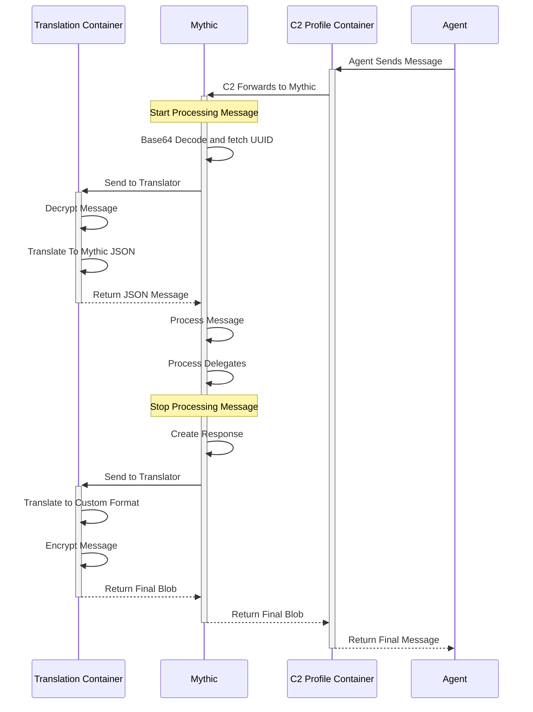

# Agent Sends Message

Here we can see an agent sends a message to Mythic. The C2 Profile container is simply a fancy redirector that know show to pull the message off the wire, it doesn't do anything else than that. From there, Mythic starts processing the message. It pulls out the UUID so it can determine which agent/callback we're talking about. This is where a decision point happens:

* If the Payload Type associated with the payload/callback for the UUID of the message has a translation container associated with it, then Mythic will send the message there. It's here that the rest of the message is converted from the agent's special sauce C2 format into the standard JSON that Mythic expects. Additionally, if the Payload Type handles encryption for itself, then this is where that happens.
* If there is not translation container associated with the payload/callback for the UUID in the message, then Mythic moves on to the next step and starts processing the message.

Mythic then processes the message according to the "action" listed.

Mythic then potentially goes back to the translation container to convert the response message back to the agent's custom C2 spec before finally returning everything back through the C2 Profile docker container.
