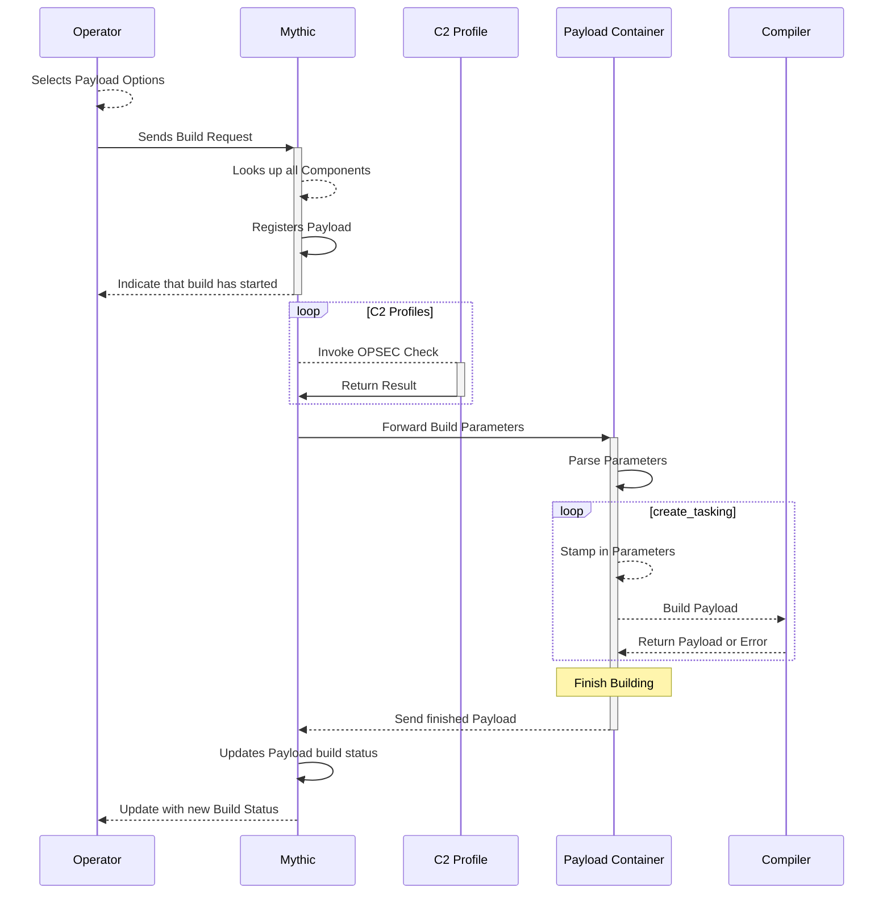

# Building Payloads

Here we can see that the operator selects the different payload options they desire in the web user interface and clicks submit. That information goes to Mythic which looks up all the database objects corresponding to the user's selection. Mythic then registers a payload in a `building` state. Mythic sends all this information to the corresponding Payload Type container to build an agent to meet the desired specifications. The corresponding `build` command parses these parameters, stamps in any required user parameters (such as callback host, port, jitter, etc) and uses any user supplied build parameters (such as exe/dll/raw) to build the agent.

In the build process, there's a lot of room for customizing. Since it's all async through rabbitMQ, you are free to stamp code together, spin off subprocesses (like mono or go) to build your agent, or even make web requests to CI/CD pipelines to build the agent for you. Eventually, this process either returns an agent or some sort of error. That final result gets send back to Mythic via rabbitMQ which then updates the database and user interface to allow an operator to download their payload.
