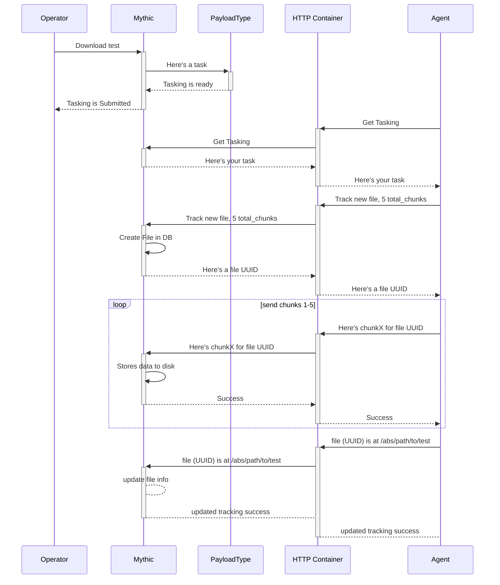

# File Download Agent->Mythic

When you're downloading a file from the Agent to Mythic (such as a file on disk, a screenshot, or some large piece of memory that you want to track as a file), you have to indicate in some way that this data is specific to a file and not destined to be part of the information displayed to the user. The way this works is pretty much the inverse of what happens for uploads. Specifically, an agent has a file it wants to transfer, so it tells Mythic "i have data, i'm gonna send it as X chunks of size Y, can you give me a UUID so we can track this". Mythic tracks the data and gives back a UUID. Now the agent sends each chunk individually and Mythic can track it. This allows a single task to be able to send back multiple files concurrently or sequentially and still track it all.

