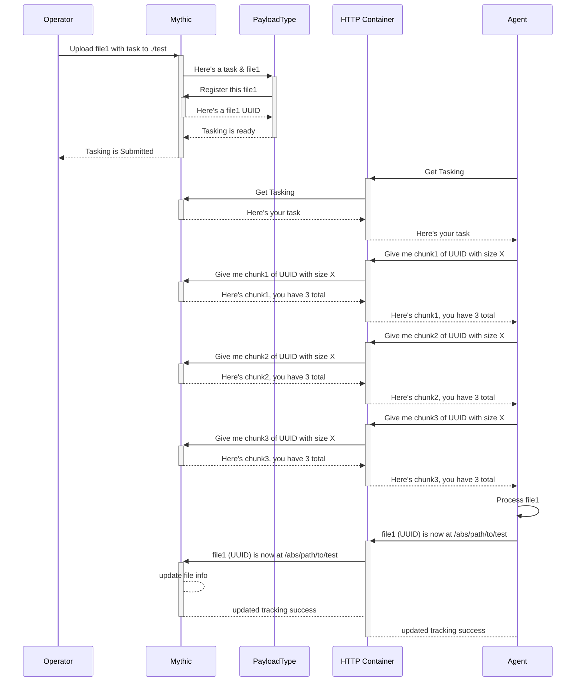
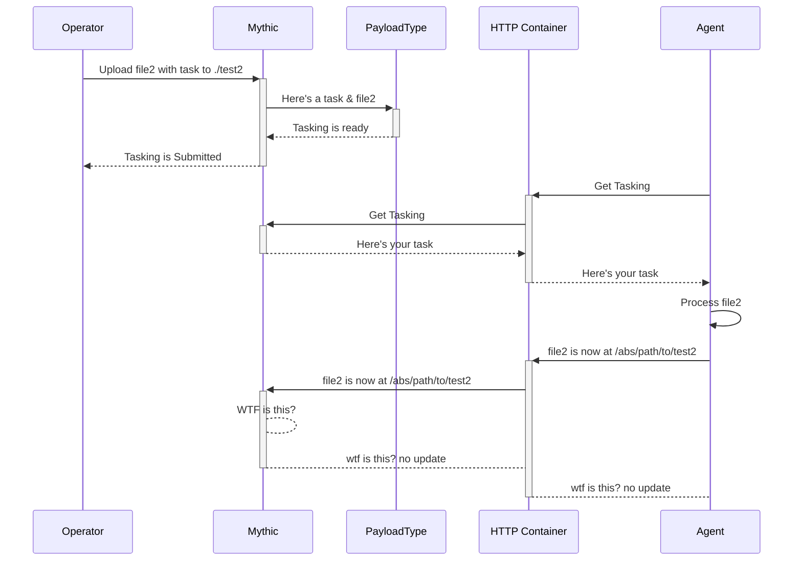

# File Upload Mythic->Agent

What happens when you want to transfer a file from Mythic -> Agent? There's two different options: tracking a file via a UUID and pulling down chunks or just sending the file as part of your tasking.

This is an example of an operator uploading a file, it getting processed at the Payload Type's `create_tasking` function where it tracks and registers the file within Mythic. Now the tasking has a UUID for the file rather than the file contents itself. This allows Mythic and the Agent to uniquely reference a file. The agent gets tasking, sees the file id, and submits more requests to fetch the file. Upon finally getting the full file, it resolves the relative upload path into an absolute path and sends an update back to Mythic to let it know that the file the operator said to upload to `./test` is actually at `/abs/pah/to/test` on the target host.

Conversely, you can opt to not track the file (or track the file within Mythic, but not send the UUID down to the agent). In this case, you can't easily reference the same instance of the file between the Agent and Mythic:

You're able to upload and transfer the file just fine, but when it comes to reporting back information on it, Mythic and the Agent can't agree on the same file, so it doesn't get updated. You might be thinking that this is silly, of course the two know what the file is, it was just uploaded. Consider the case of files being deleted or multiple instances of a file being uploaded.
