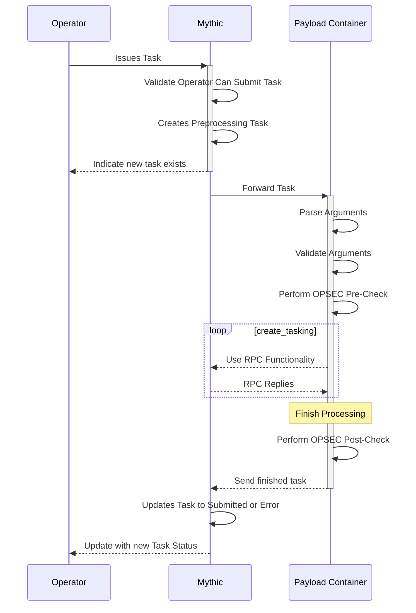

# Operator Submits Tasking

There's a lot of moving pieces within Mythic and its agents, so it's helpful to take a step back and see how messages are flowing between the different components.

Here we can see an operator issue tasking to the Mythic server. The Mythic server registers the task as "preprocessing" and informs the operator that it got the task. Mythic then sends the task off to the corresponding Payload Type container for processing. The container looks up the corresponding command python file, parses the arguments, validates the arguments, and passes the resulting parameters to the create\_tasking function. This function can leverage a bunch of RPC functionality going back to Mythic to register files, send output, etc. When it's done, it sends the final parameters back to Mythic which updates the Task to either `Submitted` or `Error`. Now that the task is out of the `preprocessing` state, when an agent checks in, it can receive the task.
