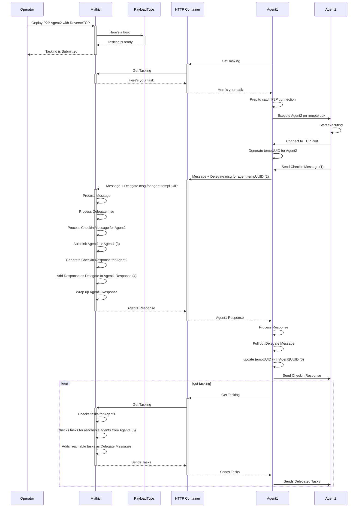

# P2P Messages

More information on P2P message communication can be found [here](../customizing/c2-related-development/agent-side-coding/delegates.md).



1\. P2P agents do their "C2 Comms" (which in this case is reaching out to agent1 over the decided TCP port) and start their Checkin/Encrypted Key Exchange/etc.

2\. When Agent1 gets a connection from Agent2, there's a lot of unknowns. Agent2 could be a new payload that isn't registered as a callback in Mythic yet. It could be an already existing callback that you're re-linking to or linking to for the first time from this callback. Either way, Agent1 doesn't know anything about Agent2 other than it connected to the right port, so it generates a temporary UUID to refer to that connection and waits for a message from Agent 2 (the first message sent through should always be from Agent2->Agent1 with a checkin message). Agent1 sends this information out with its next message as a "Delegate" Message of the form:

```javascript
{
    "action": "some action here",
    "delegates": [
        {
            "message": agentMessage,
            "uuid": UUID,
            "c2_profile": "ProfileName"
        }
    ]
}
```

This "delegates" key sits at the same level as the "action" key and can go with any message (upload, checkin, post\_response, etc). The "message" field is the checkin message from Agent2, the "uuid" field is the tempUUID that agent1 generated, and the "c2\_profile" is the name of the C2 profile that the two agents are using to connect.

3\. When Mythic parses this delegate message, it can automatically assume that there's a connection between Agent1 and Agent2 because Agent1's message has a Deleggate from Agent 2.

4\. When Mythic is done processing Agent2's checkin message, it takes that result and adds it as a "delegate" message back for Agent1's message.

5\. When Agent1 gets its message back, it sees that there is a delegate message. That message is of the format:

```javascript
{
    "action": "some action here",
    "delegates": [
        {
            "message": agentMessage,
            "uuid": "same UUID as the message agent -> mythic",
            "mythic_uuid": UUID that mythic uses
        }
    ]
}
```

6\. You can see that the response format is a little different. We don't need to echo back the C2 Profile because the agent already knows that information. The "message" field is the Mythic response that goes back to Agent 2. The "uuid" field is the same tempUUID that the agent sent in the message to Mythic. The "mythic\_uuid" field though is Mythic indicating back to Agent1 that it doesn't know what `tempUUID` is, but the agent that sent that message actually has this UUID. That allows the agent to update its records. The main reason this is important is in the case where the connection between Agent1 and Agent2 goes away. Agent1 has to have some way of indicating to Mythic that Agent2 is no longer talking to it. Mythic only knows Agent2 by its UUID, so if Agent1 tried to report that it could no longer talk to tempUUID, Mythic would have no idea who that is.
